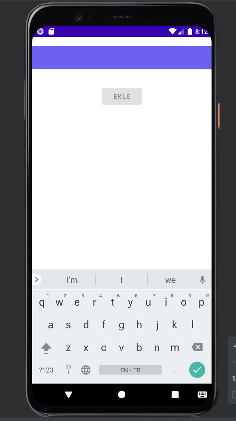
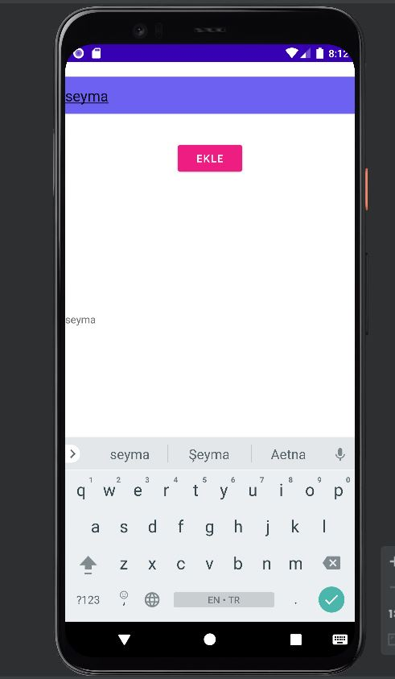
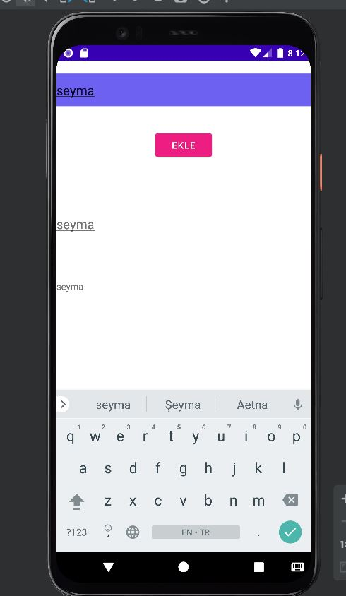

# seymafirat-odev1
FİGMA EKRANLARI

Login ekranının ekran görüntüsü:

Anasayfanın ekran görüntüsü:

Anasayfada listelenen restoranlar için recyclerview componenti kullanıldı.

LIVE DATA

Edittexte veri girilmeden buton enabled=false durumunda. Edittexte veri girişi olduktan sonra enabled=true oluyor. Textviewde girilen değer gösterilirken, butona tıklayınca kaydediliyor.

